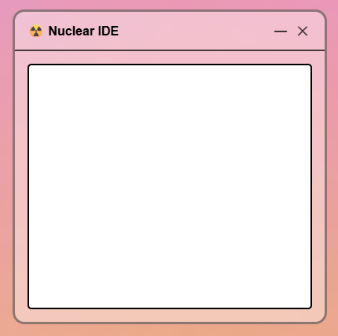
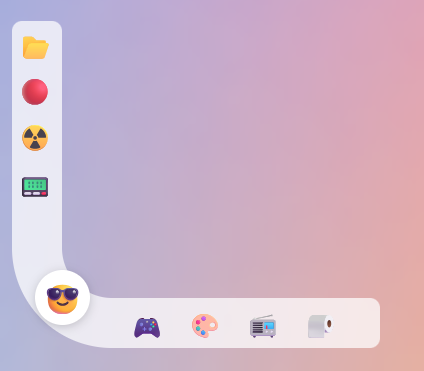
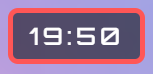
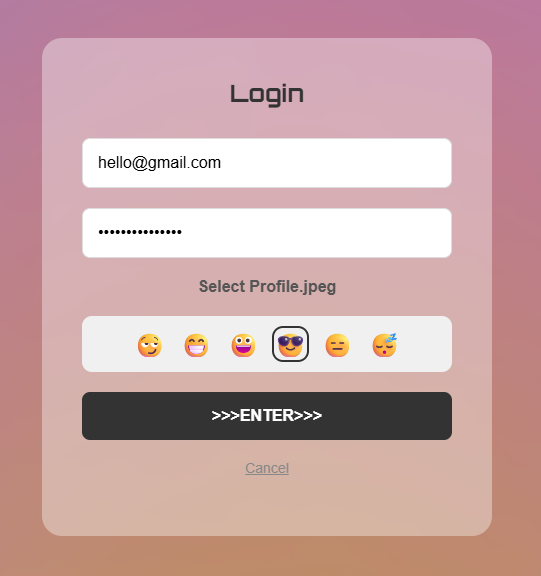

About:                        
  An OS that is programmed as a website — to be frank, it is like a mini operating system that runs entirely inside a browser.
  A user could just open the webpage and the user can interact with apps, windows, and a desktop-like interface.

Features:                       
  Window-based interface with open, close, and minimize controls
  Easily the user can switch apps(only one active window at a time)
  “state saving” for "NUCLEAR IDE" an app in which you could type and minimize and then reopen it and work.

  

📂 Files (basic placeholder system)                 
🔴 Search tool (UI placeholder)                                     
☢️ Nuclear IDE (text/code editor with saved content)                          
📟 Data Logger                            
🎮 Games                           
🎨 Paint                                
📻 Music                      
🧻 Settings

[All these apps are still under construction, So it will not perform its task properly, I am trying hard to do it asap]

Centered popup window design:                                  
  It has close and minimize icons                          
    Close (✕)                    
    Minimize (—)

Profile System:                     
  Emoji-based profile picture selection, the selected profile emoji will be    displayed on the curve of the taskbar

Taskbar UI:               
  A unique curved taskbar that uses emojis as icons with hover effect   
  It has Three elements:   
     1. verticaltaskbar            
     2. the curve                     
     3. horizontal taskbar 
     
     
     
            

Digital Clock:                     
  A real time clock at the top right corner, that displayes the exact time per region
  It has a digital clock design with 'Orbital' font
  
  

Visual Design:                        
 It uses a frosted glass design/vibe, with blur effects

 

Storage of passcodes:              
  Uses local browser Storage for the login details
  
How to Use
  1. Open the webpage
  2. Click Login
  3. Enter email and password
  4. Choose a profile emoji
  5. Start using apps from the taskbar

Note: 
   Most of the apps are under construction </>

   Thank you </> Happy hacking [Made for Hack Club: The Game] By Siddharthan

   